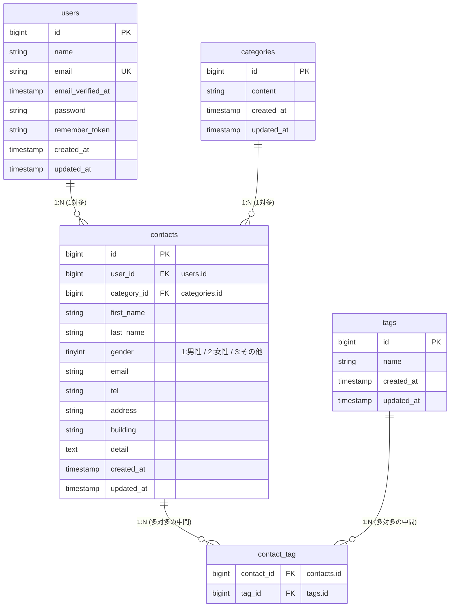

# COACHTECH お問い合わせフォーム

## 概要

Laravelを用いた高機能なお問い合わせ管理システムです。顧客からの問い合わせデータの蓄積・検索・管理から、実務を意識したCSVエクスポートや複数タグによる柔軟な分類（多対多リレーション）までを実装しています。

### 実装した機能の概要

- **管理者認証機能**: ログイン・ログアウトおよびセッション制限による安全な管理画面の保護
- **お問い合わせ一覧 & ページネーション**: 大量データも1ページ7件でスマートに表示

### 未実装機能

- **多機能検索・絞り込みフォーム**:
    - キーワード（お名前、メールアドレス）の部分一致検索
    - 性別（男性・女性・その他）の完全一致検索
    - お問い合わせの種類（カテゴリー）によるリレーション検索
    - 日付（`created_at`）指定による期間検索
- **データエクスポート機能**: 検索条件を維持した状態でのCSVファイル一括ダウンロード
- **マルチタグ管理機能**: お問い合わせ1件に対して複数のカスタムタグを付与・編集・削除できる多対多の分類機能

## 使用技術

- **Backend:** PHP 8.x / Laravel 10.x
- **Frontend:** Blade / Tailwind CSS
- **Web Server:** Nginx
- **Database:** MySQL 8.0
- **Infrastructure:** Docker / Laravel Sail (WSL2 Ubuntu 開発環境)

## 📊 データベース構造 (ER図)



## 環境構築手順

1. Laravelプロジェクトの作成 (Laravel 10.x)
   注意: curl -s "https://laravel.build/..." は最新版のLaravelをインストールするため、今回は使用しません。

以下のDockerコマンドを実行して、Laravel 10.xを明示的に指定してプロジェクトを作成します。

# Laravel 10.x を指定してプロジェクトを作成

```
docker run --rm \
 -u "$(id -u):$(id -g)" \
 -v "$(pwd):/var/www/html" \
 -w /var/www/html \
 -e COMPOSER_CACHE_DIR=/tmp/composer_cache \
 laravelsail/php82-composer:latest \
 composer create-project laravel/laravel:^10.0 contact-form-app
```

2. Laravel Sailのインストール
   プロジェクト作成後、contact-form-app ディレクトリに移動し、Laravel Sailをインストールします。

    # プロジェクトディレクトリに移動

    ```
    cd contact-form-app
    ```

    # Laravel Sailをインストール

    ```
    docker run --rm \
     -u "$(id -u):$(id -g)" \
     -v "$(pwd):/var/www/html" \
     -w /var/www/html \
     -e COMPOSER_CACHE_DIR=/tmp/composer_cache \
     laravelsail/php82-composer:latest \
     composer require laravel/sail --dev
    ```

    # Sailの設定ファイルをパブリッシュ（MySQLを選択）

    ```
    docker run --rm \
     -u "$(id -u):$(id -g)" \
     -v "$(pwd):/var/www/html" \
     -w /var/www/html \
     -e COMPOSER_CACHE_DIR=/tmp/composer_cache \
     laravelsail/php82-composer:latest \
     php artisan sail:install --with=mysql
    ```

    # ※M1/M2/M3 Mac（Apple Silicon）をお使いの方

    Apple Silicon搭載のMacでは、`sail up -d`実行時に以下のエラーが発生することがあります：

    ```
    no matching manifest for linux/arm64/v8
    ```

    解決方法: `compose.yaml`を開き、mysqlサービスに`platform: 'linux/amd64'`を追加してください。

    ```
    mysql:
    image: 'mysql/mysql-server:8.0'
    platform: 'linux/amd64' # ← この行を追加
    ports:
    ```

3. .env ファイルの設定
   .env ファイルを開き、データベース接続情報が以下と一致していることを確認します。
    ```
    DB_CONNECTION=mysql
    DB_HOST=mysql
    DB_PORT=3306
    DB_DATABASE=laravel
    DB_USERNAME=sail
    DB_PASSWORD=password
    ```

重要: DB_HOST は localhost や 127.0.0.1 ではなく、Dockerコンテナ名である mysql を指定します。

4. フロントエンドのセットアップ (Vite & Tailwind CSS)
   本プロジェクトでは、フロントエンドのスタイリングにTailwind CSSを使用します。

    ①NPM依存パッケージのインストール

    > 重要: sail npm install を実行する前に、必ずSailコンテナが起動していることを確認してください。
    > sail npm install

    ②Tailwind CSSのインストール

    ```
    sail npm install -D tailwindcss@^3.4.0 postcss autoprefixer
    sail npm install alpinejs
    ```

    ③設定ファイルの生成

    ```
    sail npx tailwindcss init -p
    ④Tailwind CSSのテンプレートパス設定
    tailwind.config.js を開き、以下のように設定します。
    /** @type {import("tailwindcss").Config} \*/
    export default {
    content: [
    "./resources/**/_.blade.php",
    "./resources/\*\*/_.js",
    "./resources/\*_/_.vue",
    ],
    theme: {
    extend: {},
    },
    plugins: [],
    }
    ```

    ➄提供リポジトリのresourcesディレクトリと入れ替え
    以下のリポジトリをクローンし、resourcesディレクトリを丸ごと入れ替えます。

    ```
    git clone https://github.com/coachtech-prepared-file/Preparedblade-ConfirmationTest-ContactForm.git
    ```

    入れ替え手順:
    a.Finderでプロジェクトフォルダを開きます。
    open .
    b.プロジェクト内の resources フォルダを削除します。
    c.クローンしたリポジトリ内の resources フォルダをプロジェクト直下にコピーします。

    ※コマンド操作に慣れている場合は rm -rf と cp -r でも可能ですが、誤削除を防ぐためFinderでの操作を推奨します。

    ⑥Vite開発サーバーの起動

    ```
    sail npm run dev
    ```

    注意: sail npm run dev は実行したままにしておく必要があります。

5. phpMyAdminの追加
   compose.yaml を開き、mysql サービスの後に以下の設定を追加してください。

compose.yaml に追加する内容:

    phpmyadmin:
        image: 'phpmyadmin:latest'
        ports:
            - '${FORWARD_PHPMYADMIN_PORT:-8080}:80'
        environment:
            PMA_HOST: mysql
            PMA_USER: '${DB_USERNAME}'
            PMA_PASSWORD: '${DB_PASSWORD}'
        networks:
            - sail
        depends_on:
            - mysql

6. Sailの起動とエイリアス設定

# Sailをバックグラウンドで起動

```
./vendor/bin/sail up -d
```

# エイリアスを設定して 'sail' だけでコマンドを実行できるようにする

```
echo "alias sail='[ -f sail ] && bash sail || bash vendor/bin/sail'" >> ~/.zshrc
```

# または bash の場合

# echo "alias sail='[ -f sail ] && bash sail || bash vendor/bin/sail'" >> ~/.bashrc

# シェルを再起動するか、新しいターミナルを開いてエイリアスを有効にする

exec $SHELL

7. アプリケーションキーの生成
   ルートで以下のコマンドを実行する

    ```
    sail artisan key:generate
    ```

8. データベースのマイグレーションと初期データ投入
   以下のコマンドでテーブルを作成し、初期データを投入します。
    ```
    sail artisan migrate --seed
    ```

※既存のデータベースをリセットしたい場合は以下を実行してください。

```
sail artisan migrate:fresh --seed
```

## 作成者

oe akira

```

```

```

```
